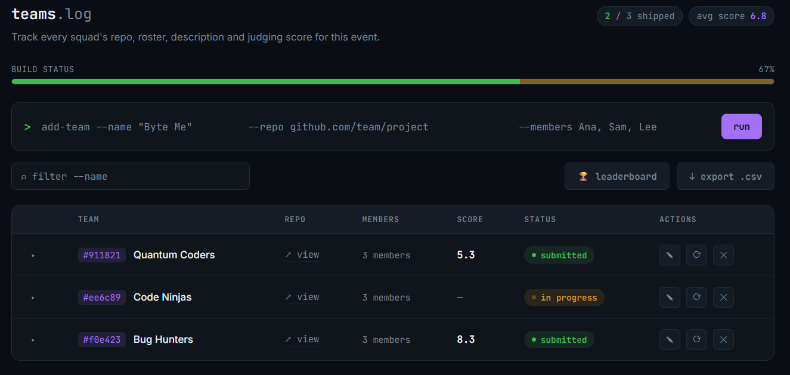
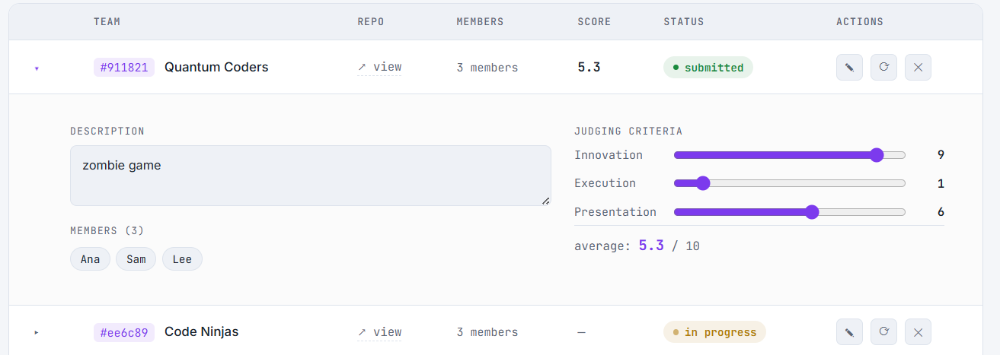
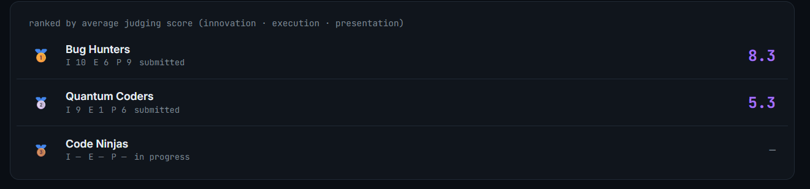
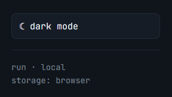

# Hackathon Toolkit 🛠️
# HackAdmin

A lightweight, single-page dashboard for running a hackathon: log teams, track their repos and rosters, judge them against criteria, and export everything to CSV. No backend, no build step — just open `index.html` in a browser.


## Features

- **Team log** — add a team with its name, GitHub repo, and member names in one line, git-commit style.
- **Status tracking** — toggle each team between `in progress` and `submitted`, with a live build-status bar showing overall completion.
- **Judging criteria** — score every team on Innovation, Execution, and Presentation (0–10 each) via sliders in an expandable details panel. An average is calculated automatically.
- **Team details** — expand any row to add a project description and see the full member roster as chips.
- **Leaderboard** — a ranked, medal-topped view sorted by average judging score.
- **Search & sort** — filter teams by name, member, or description; click column headers to sort by name, score, or status.
- **Inline editing** — edit a team's name, repo, or members without leaving the row.
- **CSV export** — download all team data (roster, description, scores, status) as `teams.csv`.
- **Dark / light theme** — toggle from the sidebar; your choice is remembered.
- **Persistent storage** — everything is saved to the browser's `localStorage`, so data survives a page refresh.

## Screenshots

### Team log
The main view — teams, repo links, member counts, average score, status, and quick actions, with the build-status bar tracking overall completion.



### Team details & judging
Expanding a row reveals the project description, full member roster, and the Innovation / Execution / Presentation sliders with a live average.



### Leaderboard
Teams ranked by average judging score, with medals for the top 3 and a per-criterion breakdown.



### Theme toggle
Switch between dark and light mode from the sidebar — your preference is remembered on reload.



## Getting started

1. Download all three files: `index.html`, `style.css`, `script.js`.
2. Keep them together in the same folder — `index.html` loads the other two by relative path.
3. Open `index.html` in any modern browser (Chrome, Firefox, Edge, Safari).

No installation, no server, no dependencies to install. An internet connection is only needed to load the Google Fonts (JetBrains Mono, Inter); the app still works offline, just with fallback fonts.

## Usage

| Action | How |
|---|---|
| Add a team | Fill in the `add-team` line (name, repo, members) and click **run** or press Enter |
| Change status | Click the status badge, or the ⟳ icon |
| View/edit details | Click the ▸ arrow to expand a row, or ✎ to edit name/repo/members |
| Score a team | Expand the row, drag the Innovation / Execution / Presentation sliders |
| Search | Type in the filter box — matches name, members, and description |
| Sort | Click the **Team**, **Score**, or **Status** column headers |
| See rankings | Click **🏆 leaderboard** in the toolbar |
| Export data | Click **↓ export .csv** |
| Switch theme | Click the theme button at the bottom of the sidebar |
| Delete a team | Click ✕ in the row's actions |

## File structure

```
.
├── index.html   # page structure and layout
├── style.css    # theme, layout, and component styling
├── script.js    # app state, rendering, and all interactivity
└── README.md
```

## Data & privacy

All data is stored locally in your browser via `localStorage` — nothing is sent to a server. This also means:
- Data is specific to one browser on one device; it won't sync across devices.
- Clearing your browser's site data/cache will erase your teams.
- Use **export .csv** regularly if you want a backup outside the browser.

## Tech stack

Plain HTML, CSS, and JavaScript — no framework, no build tools, no npm packages. Fonts are loaded from Google Fonts (JetBrains Mono for UI/data, Inter for body text).

## Known limitations

- Single-device only (no multi-user sync or shared judging).
- No CSV *import* yet — export only.
- No undo after deleting a team.

## License

Use, modify, and adapt freely for your own event.
